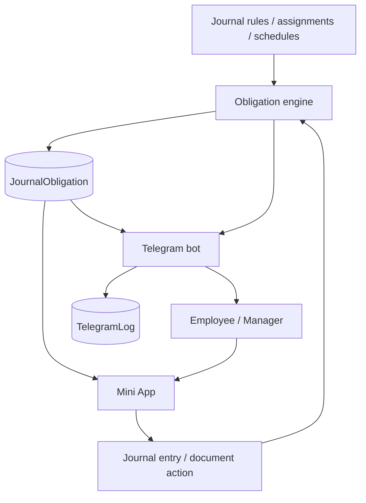

# Telegram Bot Obligation Design

Date: 2026-04-20
Status: Approved for planning
Owner: Codex

## Summary

WeSetup already has a working Telegram entrypoint:

- account linking via `BotInviteToken`
- Telegram webhook handling via `grammy`
- Mini App sign-in via Telegram `initData`
- outbound Telegram notifications and logs
- role-based access split between staff and management

What it does not have is a reliable concept of "what exactly this employee must do now". The current Mini App home infers pending work from the absence of today's entry, which is convenient for v1 but too weak for a production bot that should guide employees, managers, and the company without spamming or guessing.

The recommended design is to turn the Telegram bot into a dispatcher for concrete work, not a second full product surface. The bot should:

- open the right action in one tap
- remind only when there is a real obligation
- confirm completion and show what remains
- give managers compact digests and one-tap nudges
- share the same access rules as the web app and Mini App

## Goals

- Make Telegram the fastest path from reminder to completed journal action.
- Remove heuristic "maybe needed" reminders in favor of explicit obligations.
- Give managers operational visibility without message floods.
- Preserve the existing Mini App authentication and access model.
- Keep implementation incremental and backward-compatible.

## Non-Goals

- Rebuild the full dashboard inside Telegram chat.
- Duplicate every web workflow in chat-first form.
- Introduce two-way TasksFlow sync in this phase.
- Replace site notifications or email entirely.

## Current State

Relevant code today:

- `/start` handler: [src/lib/bot/handlers/start.ts](/C:/www/Wesetup.ru/src/lib/bot/handlers/start.ts)
- start reply builder and commands: [src/lib/bot/start-response.ts](/C:/www/Wesetup.ru/src/lib/bot/start-response.ts)
- inbound bot init: [src/lib/bot/bot-app.ts](/C:/www/Wesetup.ru/src/lib/bot/bot-app.ts)
- outbound Telegram delivery: [src/lib/telegram.ts](/C:/www/Wesetup.ru/src/lib/telegram.ts)
- Mini App home payload: [src/app/api/mini/home/route.ts](/C:/www/Wesetup.ru/src/app/api/mini/home/route.ts)
- morning digest cron: [src/app/api/cron/mini-digest/route.ts](/C:/www/Wesetup.ru/src/app/api/cron/mini-digest/route.ts)
- role access split: [src/lib/role-access.ts](/C:/www/Wesetup.ru/src/lib/role-access.ts)

Observed gaps:

1. The bot has almost no navigation model beyond `/start`.
2. Pending work is inferred from missing entries instead of assigned obligations.
3. Managers receive alerts, but not a clean operational digest for staff completion.
4. Telegram deep links do not yet consistently land on the exact required action.
5. Document journals still break the "one tap to done" promise in mobile flows.

## Recommended Approach

### Approach A: Bot as smart dispatcher

This is the recommended option.

The bot stays thin. It does not try to become a second dashboard. It only:

- shows the employee the next relevant task
- opens the exact Mini App screen needed for that task
- confirms completion
- provides compact manager digests and reminders

Benefits:

- lowest duplication
- best chance of stable UX
- easiest to keep aligned with current Next.js and Mini App code

Trade-offs:

- requires introducing a first-class obligation model
- chat-only interactions remain intentionally limited

### Approach B: Hybrid dispatcher plus selected chat actions

The bot adds a few direct actions in chat, such as reminder acknowledgement, manager nudges, and status summaries, while still using Mini App for data entry.

Benefits:

- slightly faster manager workflows
- better "assistant" feel

Trade-offs:

- more handler complexity
- more Telegram state and callback handling

### Approach C: Chat-heavy bot

Most workflows move into Telegram messages and callback menus.

Benefits:

- feels compact on paper

Trade-offs:

- highest maintenance cost
- duplicates validation and ACL logic
- worst long-term consistency

Rejected.

## Architecture

### Core decision

Introduce a first-class `JournalObligation` layer that represents a concrete unit of work for a person and a point in time.

Without this, the bot keeps guessing. With it, the bot can link, remind, escalate, and confirm against real objects instead of heuristics.

### Proposed high-level flow

### Main components

1. Obligation engine

- Generates obligations for journals, documents, rows, or recurring duties.
- Resolves assignee, due date, journal code, action target, and current status.
- Updates status after completion or expiry.

2. Obligation-aware Mini App

- Home screen stops guessing from "today has no entry".
- It reads actual open obligations for the current user.
- Every card links to the exact action needed.

3. Telegram action router

- `/start` becomes a role-aware home.
- It shows the next action, then compact secondary actions.
- Links always target a specific obligation, not just a generic page.

4. Manager digest service

- Sends one summary message per period, not a flood.
- Shows who is overdue, who is unlinked, and who needs a nudge.
- Supports one-tap reminder actions where useful.

5. Delivery policy layer

- Dedupes repeated reminders.
- Applies cooldowns and escalation windows.
- Prevents the current class of "same thing sent again because UI or cron reran".

## Data Model

### New primary entity: `JournalObligation`

Recommended fields:

- `id`
- `organizationId`
- `userId`
- `journalTemplateId`
- `journalCode`
- `kind` (`entry`, `document`, `document-row`, `checklist`, `reminder`)
- `targetId` nullable
- `dateKey` or `dueAt`
- `status` (`pending`, `opened`, `done`, `overdue`, `cancelled`)
- `source` (`schedule`, `manager-assignment`, `document-rule`, `migration`)
- `meta` JSON for narrow target payloads
- `openedAt`
- `completedAt`
- `escalatedAt`
- `lastReminderAt`

### Supporting data

Existing `TelegramLog` remains the source of truth for delivery attempts and outcomes. No separate Telegram message ledger is needed at first.

No dedicated Telegram conversation state table is required in phase 1. Prefer stateless deep links and callback payloads to avoid over-engineering.

## UX Design

### Employee experience

Telegram should optimize for one thing: "What do I need to do right now?"

`/start` for linked employee:

- primary block: next pending obligation
- CTA: `Открыть задачу`
- secondary actions: `Сегодня`, `Мои журналы`, `Помощь`

Employee reminders:

- only for real pending obligations
- should include plain wording, due context, and one direct CTA
- after successful completion, send a short confirmation and remaining count

Mini App employee home:

- section `На сейчас`
- section `Сегодня`
- section `Остальное`
- each card tied to a concrete obligation

### Manager experience

`/start` for manager:

- summary of today's operational state
- counts: pending, overdue, unlinked, failed deliveries
- CTA: `Открыть кабинет`
- secondary actions: `Просрочки`, `Команда`, `Помощь`

Manager digests:

- morning summary
- midday overdue summary if needed
- no per-event spam unless the event is critical

Manager reminder actions:

- remind employee from digest
- open specific overdue journal
- reopen invite flow for unlinked employee

### Company-level behavior

Notification policy should be configurable per organization:

- quiet hours
- digest windows
- reminder cooldown
- escalation policy
- categories enabled for management

## Key Decisions

### ADR-001: Use obligation records instead of home-screen heuristics

Status: Accepted

Context:
The current Mini App treats "no entry today" as "needs work today". That is too weak for directed Telegram reminders and exact action links.

Decision:
Introduce explicit obligation records and make bot plus Mini App consume them.

Consequences:

- Positive: precise reminders, direct links, clear overdue logic
- Negative: extra schema and job logic

### ADR-002: Keep Telegram chat thin and action-oriented

Status: Accepted

Context:
Duplicating the product into Telegram would fork validation, ACL, and UX.

Decision:
Keep data entry in Mini App and use the bot as a dispatcher, notifier, and summary surface.

Consequences:

- Positive: less duplication, safer rollout
- Negative: chat-native power users get fewer direct chat actions

### ADR-003: Share one access model across web, mini, and bot

Status: Accepted

Context:
The repo already separates staff and management surfaces using shared helpers.

Decision:
All Telegram actions must resolve through the same role-based access model used by web and Mini App.

Consequences:

- Positive: fewer privilege leaks, more predictable UX
- Negative: bot cannot easily expose special one-off shortcuts outside policy

## Delivery Rules

### Message policy

- one obligation reminder per cooldown window
- one manager digest per digest window
- one escalation per escalation window
- no message duplication because a modal reopened, cron retried, or a page rerendered

### Deep-link policy

Every Telegram CTA should prefer this order:

1. exact obligation action
2. exact journal page
3. Mini App home

Never send users to a generic page when the system knows the exact target.

### Completion policy

After a journal action completes:

- close or update matching obligation
- send optional employee confirmation
- update manager digest state

## Error Handling

- If Telegram is linked but delivery fails, log to `TelegramLog` and surface in manager/root diagnostics.
- If a deep link target is stale, land on the nearest valid Mini App page with a short explanation.
- If the obligation was already completed, show completion state instead of a hard error.
- If the employee lost access since message delivery, deny action using shared ACL checks and offer `Помощь`.
- If the Telegram account is no longer linked, force a fresh invite path rather than guessing identity.

## Rollout Plan

### Phase 1

- add `JournalObligation`
- populate obligations for the simplest recurring employee journals
- switch Mini App home to obligation-backed data
- upgrade `/start` into a real employee/manager home

### Phase 2

- direct obligation deep links
- employee completion confirmations
- manager digests and nudges
- delivery dedupe and cooldown policy

### Phase 3

- document-journal obligation support
- richer overdue handling
- org-level notification settings
- root diagnostics for Telegram delivery health

## Testing Strategy

- unit tests for obligation generation and status transitions
- unit tests for role-aware bot reply builders
- route tests for Mini App home and obligation action resolution
- regression tests for dedupe, cooldown, and rebind-related Telegram messaging
- browser verification for Mini App entry flows on narrow mobile viewports

## Acceptance Criteria

- AC1: The system has a first-class obligation model for journal work items.
- AC2: Employee `/start` shows the next relevant action, not just a generic open-app CTA.
- AC3: Manager `/start` shows an operational summary rather than a generic open-app CTA.
- AC4: Telegram reminders target exact actions through deep links where possible.
- AC5: Reminder delivery is deduped and cooldown-governed.
- AC6: Mini App home consumes obligation data rather than "missing entry today" heuristics.
- AC7: Bot, web, and Mini App share one access policy for staff versus management.
- AC8: The design remains incremental and backward-compatible with the current invite and sign-in flow.

## Risks

- obligation generation can become incorrect if journal scheduling rules stay implicit
- document journals may need extra target modeling beyond simple entry obligations
- over-eager manager alerts will recreate the current spam problem in a prettier wrapper
- if deep links are not exact, user trust in Telegram CTAs will drop fast

## Recommendation

Build phase 1 first and ship it before adding chat-heavy features.

The highest-value move is not "more bot commands". It is introducing obligation-backed actions so the bot can stop guessing and start dispatching exact work. Once that exists, the rest of the Telegram UX becomes straightforward and much less fragile.
